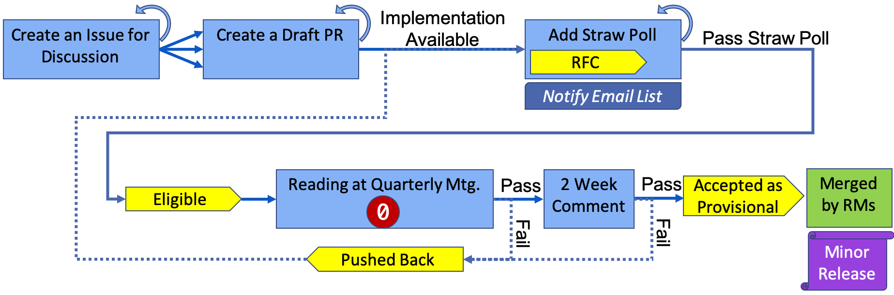
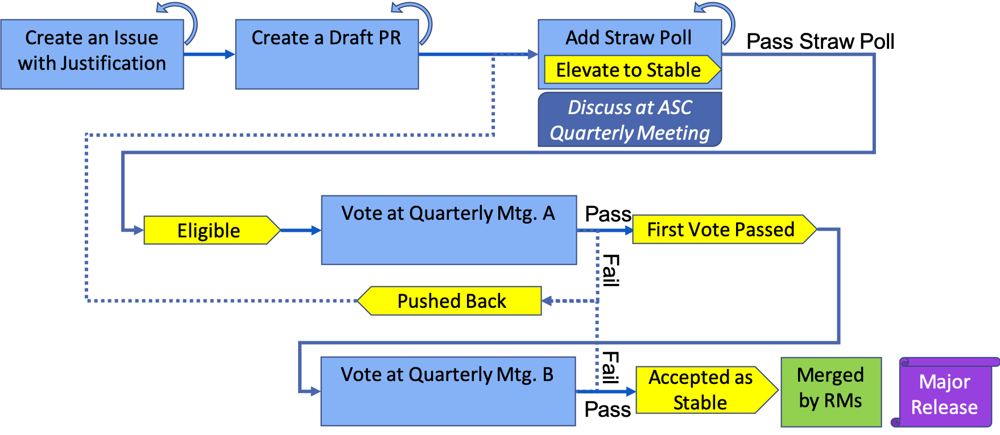
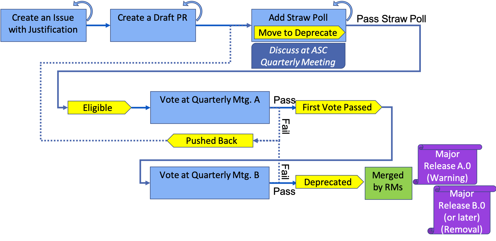

# PMIx Standard Governance Document

Rules used by the Administrative Steering Committee (ASC) for the PMIx Standard.

 * Current version of the [The PMIx Standard Governance Rules](https://github.com/pmix/governance/releases/latest)
 * [Straw Poll Comment Template](https://github.com/pmix/governance/blob/master/StrawPollComment.txt)
 * PMIx Standard [repo](https://github.com/pmix/pmix-standard)

# PMIx Administrative Steering Committee

## Leadership

* Co-Chairs
  * Kathryn Mohror, LLNL (2022-2024) (even year)
  * Joshua Hursey, IBM (2021-2023) (odd year)
  * Outgoing / Former
    * Kathryn Mohror, LLNL (2020-2022) (even year)
    * Joshua Hursey, IBM (2019-2021) (odd year)
    * Ralph Castain, Intel (2018-2020) (even year)
* Secretaries
  * Thomas Naughton, ORNL (2022-2024) (even year)
  * Aurelien Bouteiller, UTK (2021-2023) (odd year)
  * Outgoing / Former
    * Thomas Naughton, ORNL (2020-2022) (even year)
    * Stephen Herbein, LLNL (2019-2021) (odd year)
* Release Managers for PMIx v5
  * Ken Raffenetti, ANL
  * David Solt, IBM

## Membership

* **Altair**
  * Michael Karo (Rep.)
* **Argonne**
  * Ken Raffenetti (Rep.)
  * Shane Snyder (Alt.)
* **IBM**
  * Joshua Hursey (Rep.)
  * David Solt (Alt.)
* **INRIA**
  * Brice Goglin (Rep.)
  * Guillaume Mercier (Alt.)
* **Intel**
  * Jai Dayal (Rep.)
* **LANL**
  * Howard Pritchard (Rep.)
* **LLNL**
  * Kathryn Mohror (Rep.)
* **NVIDIA (Mellanox)**
  * Artem Polyakov (Rep.)
  * Joshua Ladd (Alt.)
* **ORNL**
  * Thomas Naughton (Rep.)
  * Swaroop Pophale (Alt.)
* **OSU**
  * Hari Subramoni (Rep.)
  * Nat Shineman (Alt.)
* **Perforce**
  * John DelSignore (Rep.)
* **TU Munich**
  * Martin Schulz (Rep.)
* **UTK**
  * Aurelien Bouteiller (Rep.)
* **Nanook Consulting**
  * Ralph Castain (Rep.)

# ASC Voting Process Visualizations

Below are visualizations that summarize the process for voting on PMIx items.
These visualizations are provided only for conveinence and the governance
document should be considered the main source of truth.

## Acceptance to Provisional

## Elevation to Stable

## Deprection from Stable

